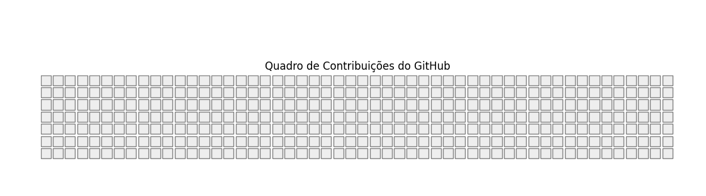

# Quadro de Contribuições do GitHub

Este projeto fornece uma ferramenta para simular o quadro de contribuições do GitHub, utilizando a biblioteca `matplotlib` para visualização.




## Descrição

O programa gera uma visualização que imita o quadro de contribuições do GitHub. A matriz de entrada representa os dias de contribuição, onde `1` indica um dia com contribuição (verde) e `0` indica um dia sem contribuição (branco).

## Requisitos

- Python
- Bibliotecas:
  - `matplotlib`
  - `numpy`

Para instalar as dependências, execute:

```
pip install matplotlib numpy
```

## Uso

1. Clone este repositório ou baixe o arquivo principal.
2. Execute o script Python para gerar e visualizar o quadro de contribuições.

```bash
python create_graph.py
```

## Personalização

Para personalizar o quadro de contribuições, modifique a matriz `matriz` no código. Esta matriz 2D (7xN) representa os dias de contribuição ao longo das semanas.
